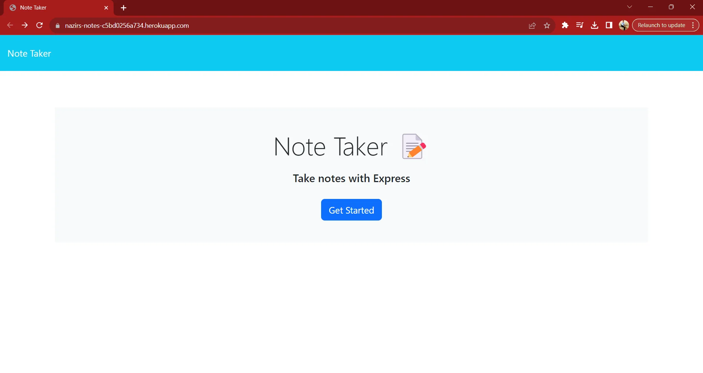

# Nazirs Note Taker

## Description
Nazir's Note Taker is a straightforward app designed for easy note-taking. Capture your thoughts, ideas, and important details with its user-friendly interface. Keep your notes organized and accessible without any unnecessary extravagances. Simple tool for taking notes.

## Technologies Used
- HTML
- CSS
- JavaScript
- Sass
- Bootstrap
- Node.js
- purgecss

Deployed Site: https://notes-app-dllx.onrender.com/

GitHub Repo: https://github.com/Batking74/Notes-App
